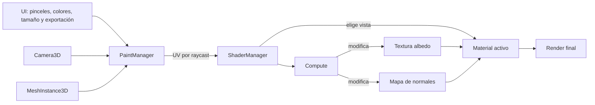

# NormalPaint

## Índice
1. [Vídeo](#vídeo)
1. [Controles](#controles)
1. [Autoras](#autoras)
2. [Resumen](#resumen)
3. [Instalación y uso](#instalación-y-uso)
4. [Introducción](#introducción)
5. [Planteamiento del proyecto](#planteamiento-del-proyecto)
6. [Estructura](#estructura)
7. [Implementación](#implementación)
8. [Métricas](#métricas)
9. [Conclusiones](#conclusiones)
9. [Ampliaciones](#ampliaciones)
10. [Licencia](#licencia)
11. [Referencias](#referencias)

## Vídeo
https://github.com/user-attachments/assets/54578e5d-8cde-414e-b9f4-fe1b8194e8c1

- [Vídeo extendido de demostración (2'24")](https://youtu.be/z4m9Ax6AlzI?si=piZM3a6mlnGsQY7o)

## Controles
Ratón:

- **LMB**: pintar sobre el modelo siguiendo la UV obtenida por raycast.
- **RMB + mover ratón**: rotar la cámara.
- **MMB + mover ratón**: orbitar alrededor del objetivo.
- **MMB + Shift**: paneo de la cámara.
- **Rueda del ratón**: zoom hacia o desde el objetivo.

Teclado:
- **WASD**: desplazamiento libre de la cámara.
- **O**: centrar el objetivo en el origen.
- **R**: restaurar la transformada inicial de la cámara.
- **T**: alternar entre la vista de textura y la vista de mapa de normales.

Interfaz:
- **Botones de pinceles**: cambiar la máscara del pincel activo.
- **Deslizador**: ajustar el tamaño del pincel.
- **Selectores de color**: cambiar el color de pintado de la capa albedo y de la capa de normales respectivamente.
- **Casilla `Double channel`**: pintar simultáneamente en ambas capas.
- **Botones de exportación**: guardar la textura albedo o el mapa de normales como PNG.

## Autoras
- Nieves Alonso Gilsanz [@nievesag](https://github.com/nievesag)
- Cynthia Tristán Álvarez [@cyntrist](https://github.com/cyntrist)

## Resumen
El proyecto consiste en una aplicación de pintura en 3D en tiempo real donde se puede pintar sobre un modelo. Se podrá elegir el pincel con el que pintar y su tamaño, el color con el que pintar y sobre qué «capa» pintar: textura albedo, mapa de normales o ambas a la vez.

## Instalación y uso
Todo el contenido del proyecto está disponible en este repositorio, con **Godot Engine v4.6.2.** o posterior siendo capaces de bajar todos los recursos necesarios y editar el proyecto.

## Introducción
Este proyecto corresponde a la práctica final de la asignatura de Iluminación y Materiales del Grado en Desarrollo de Videojuegos de la UCM del curso 2025-2026. Este prototipo sirve para poner en práctica los conocimientos de la asignatura a través de su exploración de los mapas de normales, el procesado de texturas y materiales en motores actuales y la programación de sombreadores de cómputo en GPU.

## Estructura
### Estructura del proyecto
Los recursos que conforman el proyecto están organizados de esta forma:

* **Fonts**. Fuentes utilizadas en el proyecto.
* **Materials**. Material de normales y material de textura albedo del modelo cargado actualmente.
  * **Shaders**. Shader de cómputo y otros shaders usados durante el desarrollo.
* **Mesh**. Modelos preparados para usarse en la escena.
* **Scenes**. La escena principal.
* **Textures**. Imágenes importadas como texturas utilizadas en interfaces, máscaras de pincel y texturas.
* **Themes**. Temas de la UI.
* **Scripts**. Todas las clases con el código del proyecto.
  * **Autoloads**. Scripts singletons.

#### Jerarquía de recursos
```text
assets
├── fonts
├── materials
│   └── shaders
├── mesh
├── scenes
└── textures
│   ├── brushes
│   ├── cursor
│   └── normals
├── themes
scripts
└── autoloads
```

### Estructura de las escenas
Hay una única escena en el prototipo donde se podrán realizar todas las acciones: [main.tscn](https://github.com/nievesag/NormalPaint/blob/main/NormalPaint/assets/scenes/main.tscn)

## Planteamiento del proyecto
Las características principales del prototipo son:

* Se podrá inspeccionar un modelo cargado con una cámara que permite: acercarse y alejarse del modelo, orbitar a su alrededor, rotar, panear, resetearse a su posición inicial, y volver a establecer un objetivo.

* Se podrá alternar la vista del texturizado del modelo entre: vista estándar y vista de solo mapa de normales.

* Para pintar sobre la textura se seleccionará un pincel, su tamaño y el color que se va a usar para pintar en cada capa. La interfaz contará con opciones para todo esto.

* Se podrá pintar sobre ambas capas en tiempo real, permitiendo elegir si pintas solo en una de las dos o en ambas, la textura del mapa de normales se interpretará como tal haciendo que los trazos reaccionen a la luz.

* Se podrán exportar las texturas pintadas.

## Implementación
La implementación del prototipo ha abarcado, principalmente, cuatro retos: el procesado del input de un usuario, actualizar una textura según ese input procesado, gestionar las diferentes capas, y optimizar el pintado.

#### Flujo principal de pintado


### 1. Procesamiento del input y obtención de UVs
El hecho de pintar sobre un modelo implica pintar sobre la textura que le envuelve, que es la que define cómo se ve, entonces, cuando un usuario se dispone a pintar sobre un modelo, hace clic y efectúa un trazo, surge la pregunta: ¿cómo sabemos exactamente en qué punto de la textura debemos pintar, de manera interna?

Motores como Unity ofrecen una funcionalidad para esto con el método [RaycastHit.textureCoord](https://docs.unity3d.com/ScriptReference/RaycastHit-textureCoord.html), pero al estar realizando el proyecto en Godot, que no ofrece un método como este, hemos tenido que realizar el cálculo a mano.

Se empieza lanzando un rayo desde la cámara con longitud infinita en el momento del clic, si se ha colisionado con algo se intenta acceder a la mesh del objeto colisionado, gracias a la herramienta [MeshDataTool](https://docs.godotengine.org/en/stable/classes/class_meshdatatool.html) de Godot que proporciona acceso a los vértices, índices, normales, caras, UVs, etc. de la malla y al propio motor de físicas de Godot que da acceso al índice de la cara colisionada por el rayo se puede realizar el cálculo necesario para objener las UVs de la textura correspondientes a esa colisión en la malla.

Se puede denominar a esto entonces como «primer paso» en la obtención de UVs.


El «segundo paso» corresponde a los cálculos matemáticos. El prototipo funciona con mallas trianguladas, que aseguran que cada cara que compone a la malla es un triángulo.

Como ya tenemos acceso a la cara triangular colisionada podemos entonces acceder a los vértices que la conforman y con estos datos calcular las UVs haciendo uso de las **coordenadas baricéntricas**: para cualquier punto P dentro de un triángulo ABC podemos encontrar 3 *factores de interpolación* que funcionan como equivalentes a las razones de las áreas de PBC, PCA y PAB con respecto al área del triángulo de referencia ABC, de tal manera que, siendo (bx,by,bz) las coordenadas baricéntricas de P con respecto al triángulo ABC:
```
P = bx·A + by·B + bz·C
1 = bx + by + bz
```
Con este razonamiento se puede calcular:
```
// vectores a cada uno de los vértices
var v0 := b - a
var v1 := c - a
var v2 := p - a

// cálculo del baricentro
var d00 := v0.dot(v0)
var d01 := v0.dot(v1)
var d11 := v1.dot(v1)
var d20 := v2.dot(v0)
var d21 := v2.dot(v1)

var denom := d00 * d11 - d01 * d01

var v: float = (d11 * d20 - d01 * d21) / denom
var w: float = (d00 * d21 - d01 * d20) / denom
var u: float = 1.0 - v - w

var bc: Vector3 = Vector3(u, v, w)
```
Una vez se ha obtenido el baricentro el «tercer paso» resulta trivial:
```
// se multiplican los valores de los factores de interpolación asociados a cada vértice y se suma todo
var uv_from_face: Vector2 = uv0 * bc.x + uv1 * bc.y + uv2 * bc.z
```
Cuando se ha obtenido la coordenada de textura en la que se deberá pintar según el input procesado se puede pasar a la gestión del trazo en sí. Todo ello se lleva a cabo en el [paint_manager.gd](https://github.com/nievesag/NormalPaint/blob/main/NormalPaint/scripts/paint_manager.gd).

### 2. Gestión de un trazo
Los pinceles se procesan como máscaras de color, con la silueta de la forma del pincel en blanco y el fondo en negro. Entonces, para gestionar un trazo en una textura es importante conocer qué máscara de pincel se está usando, su tamaño, el color con el que se debe pintar y sobre qué capa se está pintando, que decidirá la textura que ha de ser modificada (textura albedo o mapa de normales).

Se detalla a continuación el método implementado para gestionar un trazo por CPU:

Primero se toma la textura activa y se extrae su imagen de trabajo. A partir de la UV obtenida por raycast se escala la coordenada al espacio real de la textura y se calcula el centro del trazo. Con el tamaño del pincel se define un cuadrado de trabajo alrededor de ese centro y, para cada píxel de ese cuadrado, se localiza el píxel equivalente dentro de la máscara del pincel.

La máscara se interpreta como una imagen en escala de grises: el valor de su color en cada píxel se multiplica por la fuerza global del pincel. Si el valor resultante es 0, ese píxel no se modifica. En caso contrario, se mezcla el color actual de la textura con el color del pincel mediante interpolación lineal, de forma que la máscara determina la forma final del trazo.

Una vez procesada, la textura se actualiza y vuelve a aplicarse al material correspondiente. En la versión por CPU esto implica recorrer dos bucles anidados sobre el área del pincel, lo que funciona correctamente pero penaliza el rendimiento cuando el tamaño del pincel crece o cuando se pintan muchas veces por segundo.

### 3. Materiales y capas

El prototipo trabaja con dos capas principales: la textura albedo y el mapa de normales. Ambas se mantienen como texturas de trabajo separadas para poder pintarlas de manera independiente o simultánea según la opción seleccionada en la interfaz.

La vista normal y la vista texturizada se resuelven con dos materiales distintos. Por un lado, `texture_material` es un [StandardMaterial3D](https://docs.godotengine.org/en/stable/classes/class_standardmaterial3d.html) que muestra la textura albedo y mantiene activado el normal map del modelo, apreciándose el efecto esperado real. Por otro, `normal_material` es un [ShaderMaterial](https://docs.godotengine.org/en/stable/classes/class_shadermaterial.html) usado como vista para inspeccionar el mapa de normales, aplicando el normal map pintado sobre la superficie como su propio albedo.

Cuando el usuario pulsa **T**, el [shader_manager](https://github.com/nievesag/NormalPaint/blob/main/NormalPaint/scripts/shader_manager.gd) alterna entre ambas vistas. Además, si se activa el modo de doble canal, un mismo trazo se aplica tanto a la textura albedo como al mapa de normales, usando los colores seleccionados en los [ColorPickerButton](https://docs.godotengine.org/en/stable/classes/class_colorpickerbutton.html) de la interfaz. Si no está activado, el pintado se dirige solo a la capa visible en ese momento.

Esta separación permite exportar cada resultado por separado: la textura de color y el mapa de normales se recuperan desde el [shader_manager](https://github.com/nievesag/NormalPaint/blob/main/NormalPaint/scripts/shader_manager.gd) y se guardan como archivos PNG independientes.

### 4. Optimización
Para acelerar el cálculo de la gestión de un trazo, el actualizar los píxeles de la textura deseada según una máscara en una posición de UVs dada, se hace uso de un shader de cómputo el cual permite el procesado de datos por GPU de manera que se pueden paralelizar y acelerar los cálculos. 

Para poder hacer uso de estos primero hay que preparar una puesta en marcha en GDScript, para ello lo primero es acceder al [RenderingDevice](https://docs.godotengine.org/en/stable/classes/class_renderingdevice.html) global que proporciona una abastracción de APIs gráficas de bajo nivel como Vulkan o DirectX, a través de él se podrá invocar al shader en glsl que realizará los cálculos, y a este se le pasarán datos en formato buffer para procesarlos, RenderingDevice también facilita su creación e inicialización y la asignación de los *work groups*, agrupaciones de hilos capaces de cooperar entre sí y ejecutarse en paralelo.

De esta manera se inicializa un shader de cómputo para poder usarlo más adelante.
```
// carga shader que hará los cálculos
var shader_file: RDShaderFile = load("res://assets/materials/shaders/compute_shader.glsl")
// compila shader
var shader_spirv: RDShaderSPIRV = shader_file.get_spirv()
shader = rd.shader_create_from_spirv(shader_spirv)
// crea shader pipeline
pipeline = rd.compute_pipeline_create(shader)
```
El shader necesitará tener acceso, a la imagen de la textura y a la imagen de la máscara del pincel, así como otros parámetros usados en el cálculo del pintado de un trazo.

Para poder pasar las imágenes hay que procesarlas correctamente asegurando que no cuentan con mipmaps y que su formato es RGBAF, con ello se puede pasar a crear el [RID](https://docs.godotengine.org/es/4.x/classes/class_rid.html), o id del recurso, con el que podrá ser identificado a la hora de crear el uniform que ahora sí serán los datos que le pasamos al shader. 
```
// creación de una imagen
// comprobaciones de formato
var mask_image: Image = Global.brush_mask.duplicate()
mask_image.convert(Image.FORMAT_RGBAF)
if mask_image.has_mipmaps():
  mask_image.clear_mipmaps()

// RID
var mask_view := RDTextureView.new()
var mask_format := RDTextureFormat.new()
mask_format.width = mask_image.get_width()
mask_format.height = mask_image.get_height()
mask_format.format = RenderingDevice.DATA_FORMAT_R32G32B32A32_SFLOAT
mask_format.usage_bits = (
  RenderingDevice.TEXTURE_USAGE_STORAGE_BIT +
  RenderingDevice.TEXTURE_USAGE_CAN_COPY_FROM_BIT +
  RenderingDevice.TEXTURE_USAGE_CAN_UPDATE_BIT +
  RenderingDevice.TEXTURE_USAGE_SAMPLING_BIT
)

_free_rid_if_valid(_mask_rid)
_mask_rid = rd.texture_create(mask_format, mask_view, [mask_image.get_data()])

// creación del uniform
var mask_uniform: RDUniform = RDUniform.new()
mask_uniform.uniform_type = RenderingDevice.UNIFORM_TYPE_IMAGE
mask_uniform.binding = 1 // cada uniform tiene un binding único
mask_uniform.add_id(_mask_rid)
```
Pasar datos simples es más sencillo ya que vale con llenar el RID del [PackedByteArray](https://docs.godotengine.org/en/stable/classes/class_packedbytearray.html) con los datos necesarios y asociar este de nuevo a un uniform que se adjuntará al shader.
```
// creación de un buffer
var _params_buffer: RID = rd.storage_buffer_create(empty_params.size(), empty_params)

// creación del uniform
var parameter_uniform: RDUniform = RDUniform.new()
parameter_uniform.uniform_type = RenderingDevice.UNIFORM_TYPE_STORAGE_BUFFER
parameter_uniform.binding = 0
parameter_uniform.add_id(_params_buffer)
```

Extracto de [compute_paint.gd](https://github.com/nievesag/NormalPaint/blob/main/NormalPaint/scripts/compute_paint.gd).


A estos parámetros se accede desde el glsl tal que:
```
// se caracterizan por su binding
layout(set = 0, binding = 0, std430) readonly buffer parameters {
  // se pueden acceder a todos los parámetros pasados
    float width;
    float height;
    float mask_w;
    float mask_h;
    float cx;
    float cy;
    float diameter;
    float radius;
    float brush_strength;
}
params;

layout(set = 0, binding = 1, rgba32f) uniform image2D mask; // mascara
```
Para empezar a computar el shader se siguen los siguientes pasos:
* Se empiezan a grabar los comandos para la GPU
```
var compute_list: int = rd.compute_list_begin()
```
* Bindea la pipeline, informa a la GPU de qué shader tiene que usar
```
rd.compute_list_bind_compute_pipeline(compute_list, pipeline)
```
* Bindea el set de uniforms con la información que queremos pasar a nuestro shader
```
rd.compute_list_bind_uniform_set(compute_list, uniform_set, 0)
```
* Dispatchs con los work groups (XxYxZ)
```
var groups_x := int(ceil(diameter / 32.0))
var groups_y := int(ceil(diameter / 32.0))
rd.compute_list_dispatch(compute_list, groups_x, groups_y, 1)
```
* Informa a la GPU de que hemos acabado con esta tarea
```
rd.compute_list_end()
```

Extracto de [compute_shader.glsl](https://github.com/nievesag/NormalPaint/blob/main/NormalPaint/assets/materials/shaders/compute_shader.glsl).

El shader se computa una vez por cada hilo (*invocation*), agrupados en conjuntos de 32 hilos cada uno (*workgroups*), cubriendo por porciones en función del tamaño en píxeles de la máscara de modo que cada invocación se encarga de procesar un único píxel dentro del área del pincel. Así se puede obviar el doble `for` que se ejecutaba en la versión de CPU. Pudiendo acceder a la x y la y locales de la máscara tal que así:
```
ivec2 local = ivec2(gl_GlobalInvocationID.xy);
```


El resto del código se basa en la versión de CPU y lo adapta a la paralelización con el shader basándose en este criterio.

## Métricas

En un PC de estas características:
- **CPU:** Intel Core i5-12600KF a 3.70 GHz
- **GPU:** NVIDIA GeForce RTX 5070 Ti con 16 GB
- **RAM:** 32 GB (16x2) de 4800 MT/s
- **SO:** Windows 11
- **Versión de Godot:** 4.6
  
A través del dibujado por CPU la media de FPS rondaba los 45 FPS.

A través de la versión por GPU con el shader de cómputo se manteían los 60 FPS estables.

## Conclusiones
Este proyecto nos ha permitido integrar en un único lugar varias piezas que, por separado, suelen tratarse de forma aislada: obtención de UVs sobre mallas arbitrarias, pintura en tiempo real, gestión de materiales y uso de compute shaders para acelerar el procesado. Todos estos problemas durante el desarrollo y más, como la gestión del formato de imágenes, han supuesto puntos de aprendizaje importantes. 

El resultado es un prototipo de herramienta funcional que sirve de demostración técnica tanto del pintado sobre albedo y mapas de normales resoluble de forma interactiva y con una estructura razonablemente modular, como del efecto pintoresco jugando con la iluminación de un modelo a través de la combinación del mapa de normales y la textura de su material.

## Ampliaciones
A falta de tiempo, las siguientes tareas planeadas que se han quedado como posibles ampliaciones han sido:

* Importación de modelos y texturas del usuario.
* Trazado de líneas.
* Sistema de deshacer / rehacer pinceladas.
* Pinceladas a través proyección de la silueta del cursor sobre el modelo.
* Atajos de teclado.
* Soporte real de opacidad y fuerza del pincel.

## Licencia
Nieves Alonso Gilsanz y Cynthia Tristán Álvarez, autoras de la documentación, código y recursos de este trabajo, concedemos permiso permanente para utilizar este material, con fines educativos o de investigación; ya sea para obtener datos agregados de forma anónima como para utilizarlo total o parcialmente reconociendo expresamente nuestra autoría.

## Referencias
A continuación se detallan todas las referencias bibliográficas, o de otro tipo, utilizadas para realizar este prototipo. Los recursos de terceros que se han usado son de acceso público.[^13]

El vídeo de Cody Gindy[^1] es el que ha servido de inspiración principal e idea para el proyecto: lograr un efecto de tipo pintura en un modelo a través del pintado a mano del mapa de normales y de la textura de albedo.

Para la parte de aceleración por GPU y el uso de shaders de cómputo se tomaron como base varias fuentes complementarias. Los recursos de Crigz Vs Game Dev[^2] y DevPoodle[^4] ayudaron a entender la estructura general de un compute shader en Godot y su puesta en marcha mediante *RenderingDevice*, mientras que la documentación oficial de Godot sobre compute shaders[^5] y lenguaje de shading[^6] sirvió como referencia normativa para ajustar bindings, buffers, texturas y sintaxis GLSL. La documentación de OpenGL[^12] también fue útil como fuente de información sobre funciones y convenciones y como apoyo para comprender el modelo de ejecución y las operaciones de acceso a imágenes que se emplean en el shader.

La obtención de UVs a partir de un raycast sobre la malla requirió combinar la documentación oficial de Godot sobre ray-casting[^7] con el conocimiento práctico de coordenadas baricéntricas y su interpolación[^9][^10][^11]. La referencia de godot-vertex-painter[^8] fue especialmente útil como punto de comparación para el enfoque de pintura sobre mallas arbitrarias y para validar el planteamiento de cálculo de UVs en tiempo real.

El planteamiento de pintar sobre texturas y mantener varias capas de trabajo también se apoyó en el proyecto de Alfred Reinold Baudisch[^3], que sirvió como referencia práctica para el tratamiento de texturas modificables en tiempo de ejecución. El modelo que se ha usado para la carga y demostración ha sido proporcionado por *Dizzy Engine*[^13].

[^1]: Cody Gindy. [*Making 3D animation look painterly (it's easier than you think)*](https://www.youtube.com/watch?v=s8N00rjil_4). Cody Gindy. Youtube. 2023.

[^2]: Crigz Vs Game Dev. [*How to use Compute Shaders in Godot 4*](https://www.youtube.com/watch?v=5CKvGYqagyI). Crigz Vs Game Dev. Youtube. 2022.

[^3]: Alfred Reinold Baudisch. [*Godot Engine In-game Splat Map Texture Painting (Dirt Removal Effect)*](https://github.com/alfredbaudisch/GodotRuntimeTextureSplatMapPainting/tree/master). 2022.

[^4]: DevPoodle. [*A Guide to Using Compute Shaders in Godot*](https://www.youtube.com/watch?v=ry7bv7BY56c). DevPoodle. Youtube. 2025.

[^5]: Godot Engine 4.6 documentation in English. [*Using compute shaders*](https://docs.godotengine.org/en/stable/tutorials/shaders/compute_shaders.html).

[^6]: Godot Engine 4.6 documentation in English. [*Shading language*](https://docs.godotengine.org/en/4.4/tutorials/shaders/shader_reference/shading_language.html).

[^7]: Godot Engine 4.6 documentation in English. [*Ray-casting*](https://docs.godotengine.org/en/stable/tutorials/physics/ray-casting.html#d-ray-casting-from-screen).

[^8]: Burt, M. Hollós, R. [*godot-vertex-painter*](https://github.com/bikemurt/godot-vertex-painter). 2024.

[^9]: Wikipedia Contributors. [*Barycentric coordinate system*](https://en.wikipedia.org/wiki/Barycentric_coordinate_system). Wikipedia.

[^10]: Wikipedia Contributors. [*Barycentric coordinate system*](https://en.wikipedia.org/wiki/Barycentric_coordinate_system). Wikipedia.

[^11]: Shirley, P. Marschner, S. Fundamentals of Computer Graphics, Fourth Edition. CRC Press. 2016.

[^12]: OpenGL 4.6 Reference Pages. [*OpenGL 4.6 Reference Pages*](https://registry.khronos.org/OpenGL-Refpages/gl4/).

[^13]: Dizzy Engine. [*Sea Captain Hat*](https://sketchfab.com/3d-models/sea-captain-hat-b8ef6610b4fa4a7cb6df3232c836349c). 2023.
